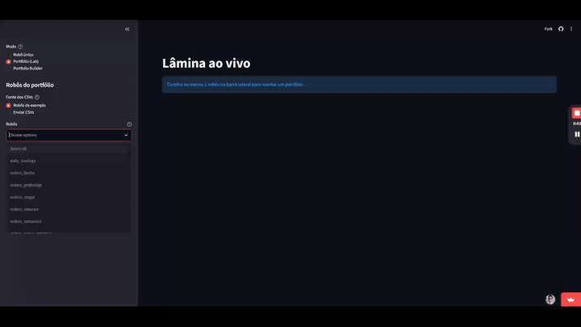
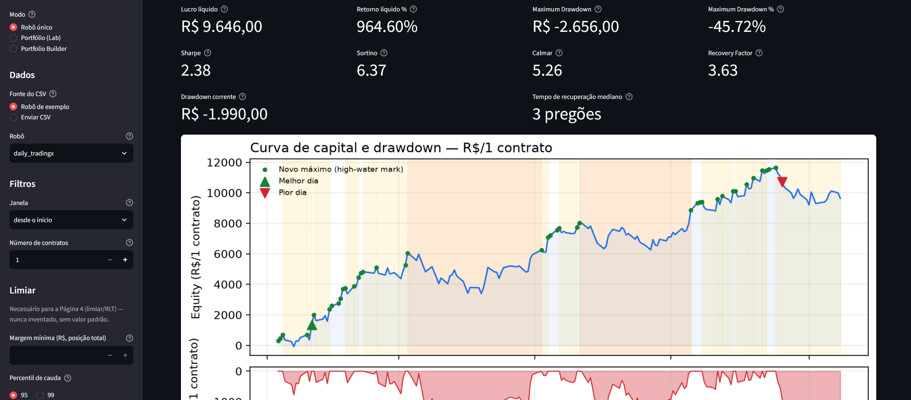
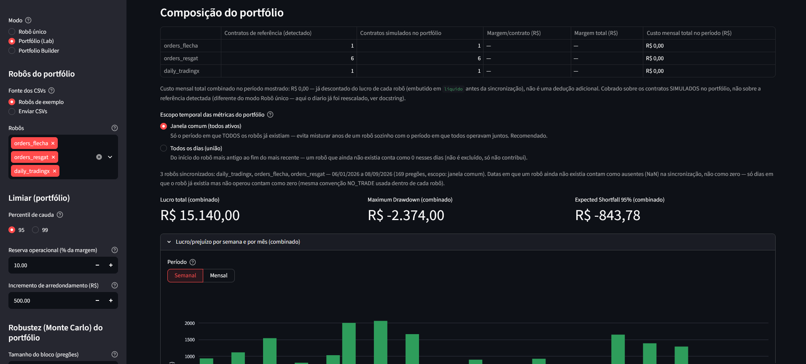
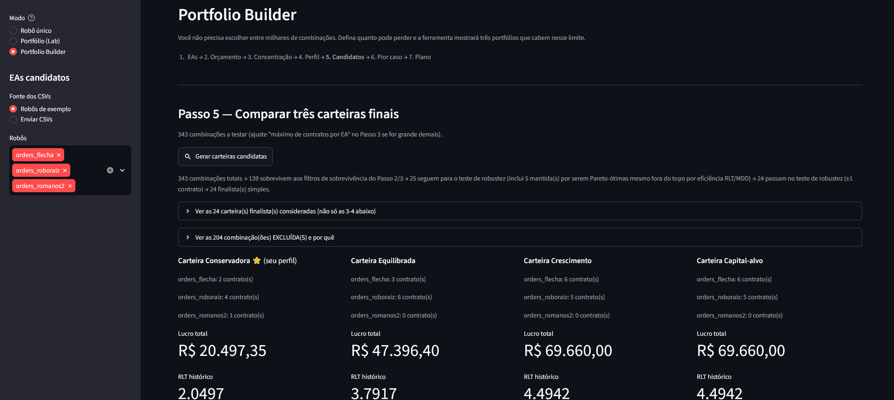

# Systematic Strategy Portfolio Analytics

A research platform for importing systematic trading-robot histories,
measuring their risk and performance, and evaluating how they behave as
components of a discrete, integer-contract portfolio — not just ranked
individually.

[](https://github.com/arthursl12/portfolio/actions/workflows/ci.yml)
[](https://codecov.io/gh/arthursl12/portfolio)
[](https://easportfolio.streamlit.app/)
[](LICENSE)
· [🇧🇷 Português](README.pt-BR.md)

**[Live demo](https://easportfolio.streamlit.app/)** · [Architecture](#architecture) · [Running locally](#running-locally)

> Personal research project under active development. Built to evaluate
> automated trading strategies as components of a portfolio, not only by
> standalone performance. Not a trading-signal service — it does not
> execute orders or give financial advice.



## Problem

Automated trading strategies are commonly evaluated in isolation (return,
Sharpe, drawdown, standalone equity curve). But strong standalone
performance does not tell you how a strategy changes a *portfolio's* risk
— it might diversify it, or it might just reproduce a risk that's already
there.

This platform exists to answer questions like:

- How does adding a strategy change aggregate portfolio drawdown?
- Does it add diversification, or does it correlate with what's already
  in the portfolio?
- Which allocations are even operationally feasible, given that
  strategies only trade in whole contracts?
- How robust is a result to the specific historical path, versus
  simulated variation (Monte Carlo)?
- Can every metric in the output be traced back to the source order data
  and the formula that produced it?

## Current capabilities

### Implemented

- Import and validate Smarttbot order-execution CSVs, with deterministic
  data-quality diagnostics (duplicate orders, exits with no P&L, unknown
  status, invalid dates/values, incomplete months, ...)
- Reconstruct trades from net position changes — not raw order rows — and
  build a daily P&L series aligned to the real B3 trading calendar
- Per-trade and per-day metrics: Profit Factor, win rate, win/loss
  streaks (length and R$), drawdown, Time Under Water, Ulcer Index,
  Sharpe/Sortino/Calmar, VaR/Expected Shortfall
- A margin-based risk threshold ("limiar") and a capital-withdrawal
  engine ("vapo") evaluated against it
- Monte Carlo robustness simulation over a strategy's trade sequence
- Multi-strategy portfolio synchronization and comparison: rolling
  correlation, risk clustering, marginal contribution to portfolio risk
- A guided funnel to build discrete (integer-contract) candidate
  portfolios — risk budgeting, concentration limits, a discrete Pareto
  frontier, a final shortlist comparison, and an operational plan
- Two output surfaces: a self-contained static HTML report ("lâmina")
  and a live Streamlit app with three modes — single-strategy report,
  portfolio analysis (Lab), and Portfolio Builder

### In progress

- Additional capital-withdrawal policies (6 of 7 named policies still
  need an explicit formula decided before implementation — see
  `AGENTS.md` §8 on never inventing a financial convention)
- Visual redesign of the Streamlit "lâmina" (status semaphore, chart
  annotations for missing-data gaps) — the underlying data already
  exists, this is UI reorganization
- An independent "missing data" signal at the portfolio level (currently
  indistinguishable from "this strategy didn't exist yet")

### Not implemented

- Run-up / drawdown-barrier analysis
- Generic (non-Smarttbot) CSV import formats
- Persisting analyses across sessions
- Broker integration or automated order execution

## Application modules

### Single-strategy report ("Lâmina")

Analyze one robot's order history in isolation: equity curve, drawdown,
trade sequences, and tail-risk metrics, rendered as a self-contained HTML
report or the first mode of the live app.



### Portfolio Lab

Synchronize two or more strategies and see what they look like combined:
correlation, risk clustering, and each strategy's marginal contribution
to portfolio-level drawdown.



### Portfolio Builder

A guided, step-by-step funnel that turns a shortlist of strategies into
operationally feasible portfolios — risk budget, concentration limits, a
discrete Pareto frontier over integer-contract combinations, and a final
comparison of candidate portfolios under historical and Monte Carlo
scenarios.



## Engineering highlights

- **Discrete portfolio allocation.** The Portfolio Builder's Pareto
  search only proposes integer-contract combinations, so every candidate
  portfolio is one you could actually place an order for — not a
  mathematically convenient continuous weight that isn't executable.
- **Analytics isolated from the interface.** `src/tradefolio/` and
  `report.py` make zero Streamlit calls; `app.py` only imports and
  renders. The same calculation functions run from the CLI (`report.py`),
  the test suite, and the live app.
- **Explicit missing-data handling.** The daily series is reindexed onto
  the real B3 trading calendar; a day the platform has no data for is
  kept distinct from a day the strategy legitimately didn't trade.
- **Domain conventions validated against the source platform, not
  invented.** The cost model, reference capital, and drawdown-percentage
  basis were reconciled exchange-by-exchange against the Smarttbot
  platform's own report (`tests/fixtures/romanos_expected.md`), not
  derived from first principles.
- **TDD on every financial calculation** — 454 automated tests, including
  regression cases for real bugs found during development (e.g. trade
  reconstruction merging trades across different instruments).

## Architecture

```text
Smarttbot order CSV
        │
        ▼
Import & validation            (loaders.py, validation.py)
        │
        ▼
Trade reconstruction           (trades.py)
Daily series on B3 calendar    (alignment.py, daily.py)
        │
        ▼
Metrics: drawdown, Ulcer Index, Sharpe/Sortino/Calmar, VaR/ES,
risk threshold, withdrawal engine, Monte Carlo robustness
        (metrics.py, drawdowns.py, limiar.py, vapo.py, monte_carlo.py, ...)
        │
        ▼
Multi-strategy sync, correlation, discrete allocation
        (portfolio.py, portfolio_builder.py)
        │
        ▼
report_data.py (page-shaped output)
        ├── report.py  → static HTML "lâmina"
        └── app.py     → live Streamlit app
```

See `CLAUDE.md` for the full architecture and domain-convention notes,
and `AGENTS.md` for the governing workflow (TDD, financial-convention
rules, scope discipline).

## Technology stack

- **Python** — domain and calculation engine
- **Pandas / NumPy** — time-series transformation and daily aggregation
- **pandas_market_calendars** — B3 trading-session calendar alignment
- **Matplotlib** — charts embedded (base64 PNG) in the static HTML report
- **Plotly** — interactive charts in the Streamlit app
- **Streamlit** — live research interface ([deployed here](https://easportfolio.streamlit.app/))
- **Pytest** — domain and regression test suite (454 tests)

## Data flow

1. Import one or more Smarttbot order CSVs; validate and flag
   data-quality issues.
2. Reconstruct trades from net position changes and build a daily P&L
   series aligned to the B3 calendar.
3. Compute per-trade and per-day metrics: drawdown, Ulcer Index,
   Sharpe/Sortino/Calmar, VaR/ES, risk threshold, withdrawals, Monte
   Carlo robustness.
4. For a portfolio: synchronize strategies, analyze correlation and
   concentration, and generate discrete (integer-contract) candidate
   allocations.
5. Render results as a static HTML "lâmina" or through the live
   Streamlit app.

## Running locally

### Requirements

- Python 3.10+
- Git

### Setup

```bash
git clone <repository-url>
cd Portfolio
python3 -m venv .venv
.venv/bin/pip install -r requirements-dev.txt
```

(`requirements-dev.txt` chains in `requirements.txt` — pandas, numpy,
matplotlib, pandas_market_calendars, plus an editable install of the
`tradefolio` package itself (`-e .`) — and adds pytest/pytest-cov. The
editable install is what makes `tradefolio` importable from anywhere in
the project, not just inside pytest.)

### Generate a report for one strategy

```bash
.venv/bin/python report.py robo path/to/orders.csv output.html --minimum-margin 5000
```

`--minimum-margin` is required — `AGENTS.md` §8 forbids inventing a
financial-convention default, so there isn't one. Run
`report.py robo --help` / `report.py portfolio --help` for the full
parameter list (Monte Carlo, deterioration scenario, monthly cost,
multi-asset detection window, ...).

### Try it without your own data

```bash
.venv/bin/python demo.py
```

Runs `report.py` over a real sample robot's order history
(`dados_exemplo/orders_romanos2.csv`) and writes `orders_romanos2.html`.

### Run the live app

```bash
.venv/bin/streamlit run app.py
```

Opens at `http://localhost:8501`. Or use the hosted version:
https://easportfolio.streamlit.app/

## Testing

```bash
.venv/bin/python -m pytest
```

454 tests covering: CSV parsing and data-quality diagnostics, trade
reconstruction from net position (not raw order rows), daily-series
alignment to the B3 calendar, drawdown/Ulcer Index/Sharpe/Sortino/Calmar,
cost and monthly-cost aggregation, risk-threshold and withdrawal-policy
calculations, Monte Carlo robustness, multi-strategy portfolio
synchronization and discrete allocation, and regression cases for real
bugs found during development.

Every push and pull request to `main` runs the full suite in CI
(`.github/workflows/ci.yml`), with coverage uploaded to
[Codecov](https://codecov.io/gh/arthursl12/portfolio).

## Selected engineering decisions

### Why integer contract allocations instead of continuous weights?

Strategies here only operate in whole contracts. A continuous-weight
optimizer can produce a mathematically attractive allocation — e.g. "2.37
contracts of Strategy A" — that simply cannot be placed as an order. The
Portfolio Builder's discrete Pareto search only proposes combinations
that are literally executable.

### Why keep calculations per-contract instead of per-account?

Every currency figure is normalized by the backtest's reference position
size. Generalizing or hiding that constant would silently change what a
number means across robots with different position sizes, so it stays
explicit instead (see `CLAUDE.md`).

### Why distinguish missing data from a no-trade day?

A day with zero P&L because a strategy legitimately didn't trade is not
the same as a day with no data because of an import gap. Conflating the
two would silently understate risk on exactly the days that matter most
for drawdown and Ulcer Index, so the daily series keeps an explicit
`operou` flag instead of collapsing both cases to zero.

## Current limitations

- Only the Smarttbot CSV export format is supported; no generic importer
  yet.
- Analyses aren't persisted — every session (CLI or Streamlit) starts
  from the source CSVs.
- Portfolio sync can't yet distinguish "robot didn't exist yet" from
  "robot's data is missing" — both currently show up as `NaN`.
- 6 of 7 named capital-withdrawal policies aren't implemented (no literal
  formula decided yet).
- Run-up / drawdown-barrier analysis isn't implemented.
- Historical and simulated results do not imply future performance;
  outputs are research artifacts, not financial recommendations.
- The platform does not execute orders or connect to a broker.

## Roadmap

- [ ] Implement the remaining capital-withdrawal policies once their
      formulas are decided
- [ ] Add an explicit missing-data signal at the portfolio level
- [ ] Run-up / drawdown-barrier analysis
- [ ] Persist analyses across sessions

## Development approach

This project is developed with AI-assisted engineering (Claude Code). AI
tools support requirement decomposition, implementation, test creation,
review, and documentation; domain definitions, financial conventions,
validation criteria, and final acceptance remain my responsibility.

Development follows a mandatory TDD workflow for anything touching
financial calculations (`AGENTS.md`): a failing test is written first,
confirmed to fail for the right reason, then the minimal implementation
is added. Edge cases discovered along the way — like a trade
reconstruction bug that merged trades across different instruments — are
kept as regression tests, not just fixed and forgotten.

## Repository structure

- `src/tradefolio/` — calculation library (validation, costs, calendar
  alignment, trade reconstruction, metrics, drawdown, portfolio,
  orchestration). See `CLAUDE.md` for the full architecture and domain
  conventions.
- `report.py` — renders the HTML report/charts from the dicts produced
  by `tradefolio.report_data`.
- `demo.py` — runs `report.py` over a real sample order history, no own
  data required.
- `app.py` — live Streamlit app (upload/sample data, window filter,
  contract-count simulation, Lab and Portfolio Builder modes).
- `dados_exemplo/` — sample CSVs for the Streamlit app (separate from
  `tests/fixtures/`, which backs the test suite).
- `sheet.py` — original reference implementation (pre-`tradefolio/`); no
  longer the path used by `report.py`.
- `tests/` — pytest suite (454 tests), including `tests/fixtures/`
  (sample data and expected values, some reconciled by hand against
  Smarttbot's own report).
- `AGENTS.md` — the mandatory workflow for changes to this repository
  (TDD, financial conventions, scope discipline).
- `CLAUDE.md` — architecture and domain-convention reference for AI
  coding assistants (and humans).

## License

MIT — see [LICENSE](LICENSE).
